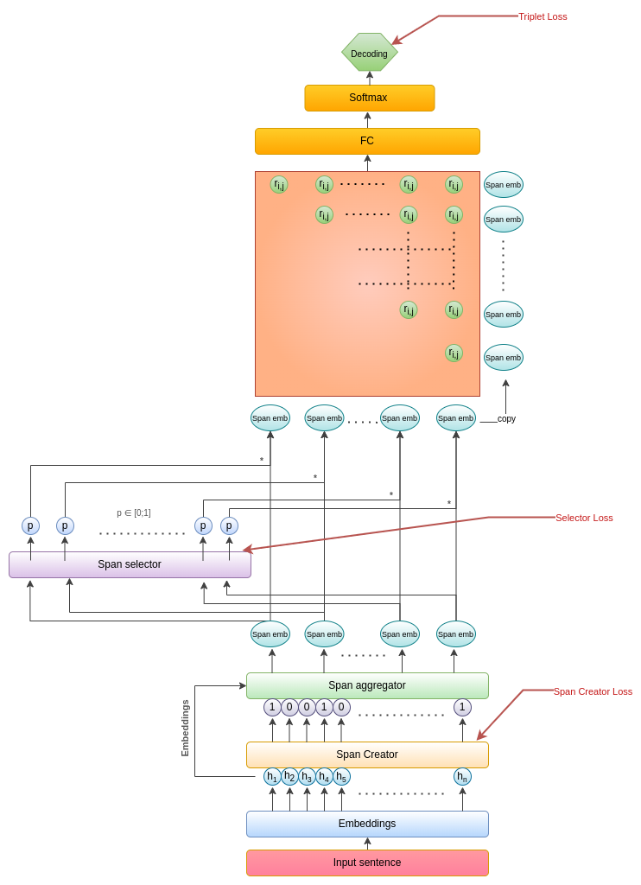

# Span-ASTE

## Brief description
This repository contains code for the Aspect Sentiment Triplet Extraction (ASTE) task.
It reduces the complexity by working on automatically selected word phrases (spans) and unifies the final results thanks to the CRF layer. 
Additionally, the selection layer supports the selection of correct phrases. 
Embedding of words are obtained thanks to BERT and embedding of phrases are aggregated using attention layer.

## Usage

#### Notes
- Tested on Python 3.8

#### Quick install
```
pip install -r requirements.txt
or
pip install .
```

#### Dataset statistics
You can compute dataset statistics to examine your data.
One way to do this is to use our implementation. A full example is available in [dataset_statistics.py](./dataset_statistics.py)
In addition, you can examine the predictions and compare the results with the labels using our provided implementation.
See example: [results_investigation.py](./results_investigation.py)

#### Dataset preparation

```python
import os
from aste.dataset.reader import DatasetLoader

dataset_name: str = '14lap'
data_path: str = os.path.join(os.getcwd(), 'dataset', 'data', 'ASTE_data_v2', dataset_name)

# Create dataset reader. Path should point out directory with data - NOT EXACT DATA FILE
dataset_reader = DatasetLoader(data_path=data_path)
# If you do not want to include sub-word elements in mask pass include_sub_words_info_in_mask=False
# BUT make sure that the embedding model also take this into account 
# (aggregate embeddings from sub-words or do not generate such situations)
dataset_reader = DatasetLoader(data_path=data_path, include_sub_words_info_in_mask=False)

# Load data. Here, you should point to extract file with data.
train_data = dataset_reader.load('train.txt')
dev_data = dataset_reader.load('dev.txt')
test_data = dataset_reader.load('test.txt')
```
#### Experiments tracker
You can keep track of your experiments. We don't do that by default. 
If you want to track them, see the example in the file: [model_examples.py](./model_examples.py), 
where we discuss how to add 'experiments tracker'.

#### Setup trainer

```python
from aste.trainer import Trainer
from aste.models import BaseModel, TransformerBaseModel

# Get Model. You can create your own definition or update existing one.
# BertBase model is our provided implementation which obtain best results so far.
model: BaseModel = TransformerBaseModel()
# here you can change model elements (as defined in aste/model/models.py)
model.emb_layer: BaseEmbedding = ...
model.span_creator: BaseModel = ...
model.aggregator: BaseAggregator = ...
model.span_selector: BaseModel = ...
model.triplets_extractor: BaseModel = ...

# Define trainer - Wrapper for model handling.
trainer: Trainer = Trainer(model=model, tracker=tracker, save_path=save_path)
```
#### Model training
```python
trainer.train(train_data=train_data, dev_data=dev_data)
```

#### Model testing
```python
# LOAD BEST MODEL
trainer.load_model(save_path)

# You can check coverage of correct detected spans
trainer.check_coverage_detected_spans(test_data)

# Or you can test your model on selected dataset
results: Dict = trainer.test(test_data)
```

#### Saving the results
```python
from aste.models import ModelMetric

results: Dict = trainer.test(test_data)
# You can also save the results. Just type:
save_path_json: str = os.path.join(os.getcwd(), 'results', 'name', 'results.json')
results[ModelMetric.NAME].to_json(path=save_path_json)
```

#### Querying the model

```python
from aste.models import ModelOutput
from aste.dataset.domain import Sentence

# If you want to feed the model with your own sentence. 
# You should include the correct tokenization of the sentence (we are not handling that at the moment).
# You should create this sentence, and call predict:
sentence = Sentence('This OS is so fast !!')
prediction: ModelOutput = trainer.predict(sentence)
# You can also save the results to file
prediction.save('sentence_result.txt')
```

You can find usage examples in the file [model_examples.py](./model_examples.py)

### Configuration
You can adapt model configuration for your specific task by creation your own [config.yml](./aste/config.yml) file and put it 
to the cwd directory. If you don't provide this file, the default one will be taken.

## Datasets
Results obtained on [ASTE_V2](https://aclanthology.org/2020.emnlp-main.183.pdf) 
and [MultiBooked](https://aclanthology.org/L18-1104.pdf) datasets. The latter was adapted for the ASTE task. 
It contains only two sentiment classes (POS, NEG). It can be found in the [this](./aste/dataset/multib) directory.

During the process of adapting the collection to the ASTE task, 
there were situations where the target or opinion was missing from a given extracted example - 
such an example was discarded (note that we are talking about an example from an aspect-opinion pair, 
not a whole sentence). During this process, we rejected 4 and 7 examples for the corresponding sets 'ca' and 'eu'.


## Solution architecture
